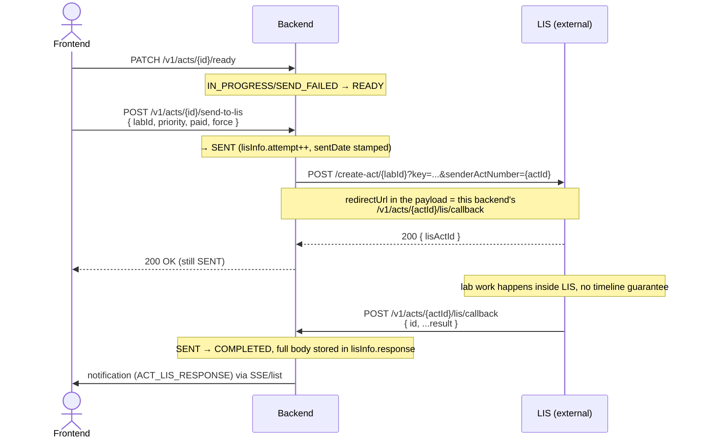

# Act ↔ LIS — frontend guide

How to drive an `Act` (`ACT153`/`154`/`223`) through its send-to-LIS and
result-callback cycle. Full backend architecture (status machine, entity
layout, LIS payload mapping) is in [`act-module.md`](./act-module.md); this
document is only about what a client-side integration needs to know.
Notification delivery mechanics (SSE, read/unread) are in
[`notification-frontend-guide.md`](./notification-frontend-guide.md) — this
guide only covers the one type Act triggers, `ACT_LIS_RESPONSE`.

> Only `ACT153`, `ACT154`, `ACT223` ever reach LIS. `ACT156`/`ACT224` are
> inspection documents with no LIS counterpart (`LisResearchCode.isSupported`)
> — sending one to LIS is a caller error (`LisUnsupportedActTypeException`),
> not a missing mapping to work around client-side.

## The result does not come back on the send request

`POST .../send-to-lis` only confirms LIS *accepted* the act — it does not
carry a result. The result arrives later, out-of-band, as a callback **LIS**
sends back to this backend. A frontend built around "await the send call,
then show the result" is built on the wrong model — it has to poll or listen
for the status to change instead.



## Endpoints

| Method | Path | Purpose | Status transition |
|---|---|---|---|
| `PUT` | `/v1/acts/{id}` | Save act fields (attached employee, any time before send) | `*` → `IN_PROGRESS` |
| `PATCH` | `/v1/acts/{id}/ready` | Mark filled-in act ready to send | `IN_PROGRESS`/`SEND_FAILED` → `READY` |
| `POST` | `/v1/acts/{id}/send-to-lis` | Submit to LIS | `READY`/`SEND_FAILED` → `SENT` |
| `POST` | `/v1/acts/{id}/lis/callback` | **Called by LIS**, never by the frontend | `SENT` → `COMPLETED` |
| `GET` | `/v1/acts/{id}` | Full detail, incl. current `status` | — |
| `DELETE` | `/v1/acts/{id}` | Soft delete — blocked once `SENT`/`COMPLETED` | — |

`send-to-lis` request body:

```jsonc
{
  "labId": 12,       // LIS's own lab id — see "Two different lab ids" below
  "priority": "URGENT", // LisPriority enum
  "paid": false,     // optional, defaults false
  "force": false     // optional — allow LIS to accept a duplicate senderActNumber
}
```

Nothing else is sent here — the rest of the LIS payload (`institution`,
`purpose`, samples, ...) is built server-side from the act's already-saved
fields (`ActLisPayloadMapper`). There is no standalone `POST /v1/acts` —
acts are only created via `POST /v1/cards/{id}/acts` (see
[`act-module.md`](./act-module.md)).

## Correlating the callback to the right act

The callback is self-identifying by URL, not by a separate protocol/act
mapping table: when sending, the backend builds
`redirectUrl = {callbackBaseUrl}/v1/acts/{actId}/lis/callback` (our own
`actId`, baked into the path — `LisUrlFactory.callbackUrl`) and hands it to
LIS inside the push payload. LIS also echoes its own act id back in the
callback body (top-level `"id"`), stored as `lisInfo.actId` — useful for
cross-referencing with LIS support, but not what correlation relies on.

> **Auth note:** `/lis/callback` is an ordinary `/v1/acts/**` endpoint,
> authenticated the same way as the rest of this API (`isAuthenticated()`,
> SSO bearer token) — there is no separate API-key/IP-allowlist channel for
> LIS the way `integration/inbound/**` has for other external submitters.
> LIS must present a valid bearer token when it calls back. Confirm with the
> backend/LIS side that this is actually wired up before relying on it in a
> demo — it is easy to assume a webhook-style unauthenticated callback here
> and be wrong.

## Two different "lab" ids — do not conflate them

| Field | Where | What it actually is | Resolved via |
|---|---|---|---|
| `Act153/154/223.lisOrganizationId` (+ `lisOrganizationName` on read) | `PUT`/`GET /v1/acts/{id}` | An id in **this system's own** `iam.Organization` table — informational only, "which org this sample is nominally addressed to" | `OrganizationLookup.activeOrganizationNameById` |
| `SendActToLisRequest.labId` | `POST /v1/acts/{id}/send-to-lis` only | **LIS's own internal laboratory id** — goes straight into the LIS URL (`/create-act/{labId}`) | supplied by the caller, not looked up locally |

These are unrelated id spaces and the backend does not cross-check them —
picking `lisOrganizationId = 5` on the act content and `labId = 7` at
send-to-lis time is accepted without complaint even if they're meant to
name the same physical lab. If product intent is that they always agree,
enforce that client-side (e.g. drive both fields off one picker) until/unless
the backend adds validation.

**By design, not a backend gap:** the labs list is fetched by the frontend
directly from `lis.sanepid.uz`, outside this backend entirely — confirmed by
the user, not something this backend proxies or needs to. This backend's
`LisActClient` only ever calls LIS for `createAct`/`resolveActTemplateId`;
it has no labs-list endpoint and isn't meant to grow one. The frontend picks
`labId` from that direct LIS lookup and passes only the chosen id into
`send-to-lis` — this backend never sees the rest of that catalog.

One thing to carry over from that direct call: whatever auth the frontend
uses against `lis.sanepid.uz` for the labs list is a separate credential
from `integration.lis.api-key` below, which stays backend-only and is never
handed to the frontend — don't reuse or expose that one for the direct
lookup.

## LIS reference/dictionary endpoints — proxied through this backend

LIS also exposes a family of **public** read-only reference endpoints for
browsing its own catalogs (organizations, departments, conditions,
professions, research types, categories, item types). **Correction to an
earlier assumption in this doc:** the `LIS_PUBLIC_...` key these use is not
a separate, lower-privileged credential — in this codebase's dev config it
is the exact same value as `integration.lis.api-key` (the key
`createAct`/`resolveActTemplateId` already use). There is only one LIS
credential, not two.

These 7 lookups populate the dropdowns behind `purpose`,
`conditions`/`noteConditions`, `packageType`, `preservationMethod`,
`sampler`/`participant` position, and `selectionActItems[].itemType` when
filling in an act — the same fields the "What actually reaches LIS" table
above maps from `id`+`uz`/`ru` embeddables.

**Implemented — proxied+cached through this backend, not fetched by the
frontend directly from LIS** (unlike the `labId` list above, which stays
direct-fetch as already documented; the two decisions aren't required to be
consistent with each other). Why proxy: the credential should not ship in
frontend code regardless of what LIS calls it, and this does not affect
report correctness either way — whatever value the frontend picks from these
dropdowns is saved back onto the act as an `id`+`uz`+`ru` snapshot at
`PUT /v1/acts/{id}` time (see the field mapping table above), and reports
read that saved snapshot from this system's own database, never from LIS.

| This backend | Method | LIS path | Notes |
|---|---|---|---|
| `/v1/lis-reference/organizations` | GET | `GET /sesorgs?name=` | `name` query param optional — LIS does its own name matching; exact semantics (substring vs. prefix) not verified here |
| `/v1/lis-reference/organizations/{organizationId}/departments` | GET | `GET /departments/{orgId}` | |
| `/v1/lis-reference/conditions` | GET | `GET /reference-dictionaries?type=CONDITIONS` | only `type=CONDITIONS` is wired up — the only type this app needs today |
| `/v1/lis-reference/professions` | GET `?search=&page=0&limit=50` | `POST /professions` | see pagination note below |
| `/v1/lis-reference/research-types` | GET `?search=&page=0&limit=50` | `POST /research-types` | |
| `/v1/lis-reference/categories` | GET `?search=&page=0&limit=50` | `POST /categories` | |
| `/v1/lis-reference/item-types` | GET `?search=&page=0&limit=50` | `POST /item-types` | |

All 7 require `isAuthenticated()` — same auth as every other `/v1/**`
endpoint, nothing LIS-specific to handle client-side.

**Why the last 4 take `search`/`page`/`limit` instead of returning the whole
list:** verified live against LIS's test environment — `professions` alone
has 12k+ rows, and LIS's own pagination defaults to 10 per page. Asking for
everything in one call (`limit` set arbitrarily high) works but was observed
to take **minutes**, far past this app's `integration.lis.read-timeout`
(15s in dev). So this backend deliberately does not try to cache "the whole
catalog" — each `(search, page, limit)` combination is cached as its own
entry instead, and `limit` is capped server-side at 200 regardless of what's
requested. Build the picker as a search-as-you-type/paginated control, not a
static preloaded dropdown, for these 4.

`organizations`, `departments`, and `conditions` show no pagination envelope
and returned their full matching set in testing (48 organizations, 7
conditions against LIS's test environment) — fetch and cache the full list
client-side same as `labId`, if convenient. That said, this was only checked
against the test environment's current, small dataset — if production's
organization catalog turns out to be an order of magnitude larger, revisit
whether "fetch everything" still holds before relying on it there.

**Caching:** every lookup is cached server-side (Caffeine, `sync=true` —
cache miss triggers exactly one LIS call, concurrent callers for the same
key wait on it rather than each firing their own request). TTL is 1h for
organizations/departments/conditions, 30m for the 4 paginated lookups. A
frontend cache on top is optional, not required for correctness — repeated
calls within the TTL are cheap.

**On LIS being down or erroring:** no special handling needed client-side
beyond normal HTTP error handling. Every one of these 7 endpoints reuses the
exact same failure path as `send-to-lis` (`LisException` → the app-wide
`GlobalExceptionHandler` → a localized `ErrorResponse`), so a LIS outage
while browsing a dropdown surfaces as a normal JSON error body with an
already-translated `message` — never a raw stack trace or a silently empty
list. Every case, including `LisBadRequestException` despite its name,
resolves to one of two HTTP statuses: `502 Bad Gateway` (LIS unreachable,
errored, refused our credentials, or sent back something unparseable) or
`504 Gateway Timeout` (LIS didn't answer in time) — e.g. *"LIS is currently
unavailable. Please try again later."* for the 502 case.

## How the frontend drives an act, end to end

1. Fill in the act (`PUT /v1/acts/{id}`), picking dictionary values from
   `/v1/lis-reference/**` above as needed.
2. `PATCH /v1/acts/{id}/ready` once complete.
3. `POST /v1/acts/{id}/send-to-lis` with `labId` (picked from the *direct*
   `lis.sanepid.uz` labs call, not `/v1/lis-reference/**`) + `priority` +
   `paid`.
4. Wait for the `ACT_LIS_RESPONSE` notification (SSE/list) — the result is
   never on the send response itself, see "The result does not come back on
   the send request" above.

**Only `ACT153`/`ACT154`/`ACT223` ever go through any of this.** `ACT156`
and `ACT224` have no LIS counterpart at all — no send-to-lis, no callback, no
`lisInfo`, and their sample-item dropdowns should still use
`/v1/lis-reference/**` for `categories`/`item-types`/`research-types` if
those act types show the same fields, but never call `send-to-lis` for them;
doing so is a caller error (`LisUnsupportedActTypeException`), not a missing
mapping to work around.

## Status lifecycle

```
NEW → IN_PROGRESS → READY → SENT → COMPLETED
                       ↑        │
                       └─ SEND_FAILED
```

| Status | Meaning | Frontend affordances |
|---|---|---|
| `NEW` / `IN_PROGRESS` | Being filled in | Edit, mark ready once complete |
| `READY` | Ready to send | Edit (drops back to `IN_PROGRESS`), send to LIS |
| `SENT` | LIS accepted it, result pending | Read-only — no edit/delete |
| `SEND_FAILED` | The *send itself* failed (network/LIS rejection) | Fix and retry (`ready` → `send-to-lis` again) |
| `COMPLETED` | LIS's result has been received | Read-only, terminal |

> **Known gap:** neither `lisInfo.lastError` (why a `SEND_FAILED` attempt
> failed) nor `lisInfo.response` (LIS's full result payload once
> `COMPLETED`) nor `lisInfo.actId` (LIS's own act id) is currently exposed
> on any `Act153/154/223DetailResponse` — they exist on the entity
> (`LisInfo` embeddable) but the response DTOs don't carry them yet. In
> practice this means the frontend can show that an act is `SEND_FAILED` or
> `COMPLETED`, but not *why* or *what the result was*, until the backend
> adds those fields to the detail response. Flag this early if the UI needs
> to show LIS results or failure reasons.

## Notification on result

Already wired up — no extra backend work needed. When the callback moves an
act `SENT → COMPLETED`, every employee attached to that act gets an
`ACT_LIS_RESPONSE` notification (feature-flagged via
`notification.act-lis-response.enabled`, default on). Consume it exactly
like any other type in
[`notification-frontend-guide.md`](./notification-frontend-guide.md) — list,
unread count, SSE stream, mark-read all work unchanged. `entityType` is
`ACT`, `entityId` is the act id, so a sensible click-through is
`GET /v1/acts/{entityId}`.

There is no separate `ACT_SEND_FAILED` notification type — a failed *send*
(network/LIS rejection) surfaces only as the act sitting in `SEND_FAILED`
status, not as a push notification.

## What actually reaches LIS — field mapping

`ActLisPayloadMapper` forwards whatever is currently saved on the act,
one-to-one — it does not fill in defaults or reject incomplete data. For
`ACT153`/`ACT154` (`ACT223` is the same shape minus manufacturer/preservation):

| `LisActPushRequest` field | Source on the act | Notes |
|---|---|---|
| `tin`, `organizationName`, `organizationAddress`, `organizationLegalAddress` | `institution.*` | null if `institution` was never filled in |
| `purpose` | `purpose.purposeId` + `purpose.samplingPurposeUz` | **Uz name only** — `samplingPurposeRu` is captured on the act but never sent to LIS |
| `conditions`, `noteConditions` | `storageAndDeliveryCondition` / `specialCondition` | same Uz-only pattern (`description.uz`) |
| `packageType`, `preservationMethod` (153 only) | `packageTypeInfo` / `conservationTypeInfo` | Uz name only |
| `sampleTakenDate`, `deliveryDateToLaboratory` | `sampleTakenDateTime` / `deliveredDateTime` | null if not set; converted from Tashkent local time to UTC ISO-8601 |
| `involvedPersonName`, `involvedProfessionId` | `participant.fullName` / `participant.positionId` | |
| `fullNameOfDoctor` | **the currently signed-in user sending the request** (`ActLisSendService.currentEmployeeFullName`) | not `act.sampler` |
| `collectorProfessionId` | `sampler.positionId` | only the position id — `sampler.fullName` is never sent |
| `manufacturer`, `manufactureDate`, `docNumber` (154 only) | act's own fields | |
| `redirectUrl` | always set (`LisUrlFactory.callbackUrl`) | |
| `paid`, `priority` | send-to-lis request body | |
| `selectionActItems` | the act's sample rows | per-type shape, see `ActLisPayloadMapper.toSelectionItem` overloads |

Two things worth double-checking against the actual LIS field spec before
assuming the payload is "complete":

- **The recorded sampler's name never reaches LIS.** Only their `positionId`
  goes over as `collectorProfessionId` — the name field sent as
  `fullNameOfDoctor` is whoever is *currently logged in and clicking send*,
  which is not necessarily the same person as `act.sampler`. If a
  coordinator sends on behalf of the field worker who actually collected the
  sample, LIS sees the coordinator's name, not the collector's.
- **Only the Uz-language name is sent** for every dictionary field (`purpose`,
  `conditions`, `packageType`, `preservationMethod`, `noteConditions`) — the
  Ru variant captured on the act (`samplingPurposeRu` etc.) is dropped. Fine
  if LIS's own UI only needs one language; worth confirming if not.

## Cross-checked against the legacy LIS client — 3 likely mapping gaps

`uz.uzinfocom.isemid` (the legacy system this rewrite is spec'd from — see
root `CLAUDE.md`) has its own `CreateLisActRequest`/`SelectionActItem`
records for the same LIS call, with field-by-field comments from whoever
built the original integration. Diffing that against this codebase's
`LisActPushRequest`/`ActLisPayloadMapper` surfaces gaps worth checking
against LIS's real schema before assuming the current payload is complete:

1. **`sampleQtUnit` is captured but never sent — confirmed in code.**
   `Act153Detail.sampleQtUnit` and `Act154Detail.sampleQtUnit` both exist as
   real, populated domain columns (`sample_qt_unit`), and
   `LisActPushRequest.SelectionActItem.sampleQtUnit` exists as a field to
   carry it — but `ActLisPayloadMapper.toSelectionItem(...)` never calls
   `.sampleQtUnit(...)` for any act type. The unit for `sampleQt`/
   `sampleWeight` is silently dropped from every LIS submission today.

2. **`packageType` is likely sent at the wrong nesting level.** The legacy
   DTO's comment on its own (act-level-stored) `packageType` field is
   explicit: *"per-item in LIS's current contract, broadcast from act-level
   value"* — i.e. LIS's real schema wants `packageType` inside every
   `selectionActItems[]` entry, and legacy copies the one act-level value
   into each item to satisfy that. This codebase's `LisActPushRequest` only
   has `packageType` at the top (act) level and never duplicates it into
   `SelectionActItem` — matching how `Act153/154/223` only store
   `packageTypeInfo` on the act, never on the `...Detail` child entity. If
   the legacy comment is accurate, LIS may simply not see package-type data
   at all today, even though the JSON "has" it.

3. **`manufacturer`/`manufactureDate` are likely sent at the wrong nesting
   level too**, same pattern: legacy's DTO carries both per
   `SelectionActItem` (sourced from `act154.detail.manufacturingCompany`/
   `manufactureDate`); this codebase's `Act154Detail` has no such per-item
   columns — `manufacturingCompany`/`manufactureDate` live only on `Act154`
   itself, and `LisActPushRequest` sends them once at the act level. For an
   act with multiple samples that legitimately have different manufacturers
   or manufacture dates, only one value reaches LIS regardless of which
   item it belongs to.

Lower-priority, cosmetic differences from the same diff — not necessarily
bugs: legacy declares a top-level `locationOwnership` field that this
codebase's `LisActPushRequest` doesn't have at all (legacy itself left it
unset too — *"LIS's full enum contract for this field is not yet
confirmed"* — so this may be intentionally dropped, not missed); legacy
also has a per-item `itemOrder` (explicit position index) that this
codebase relies on array order for instead; `brandName`/`description`/
`samplingAdditives` are "not tracked in EMIS" in both versions, so their
absence here is consistent, not a gap.

None of this is verifiable against LIS's actual schema from this codebase
alone — items 2 and 3 in particular should be confirmed with whoever has
LIS's real API contract before trusting that package type or
manufacturer/manufacture-date data is currently reaching LIS at all for
multi-sample acts.

## No server-side validation gates what can be sent

`Act153Request`/`Act154Request`/`Act223Request` and every embedded request
DTO (`InstitutionRequest`, `PurposeRequest`, `ConditionInfoRequest`, ...)
have **no `@NotNull`/`@NotBlank` on any content field** — only `@Size` (max
length) constraints. `markReady` and `send-to-lis` don't check field
completeness either, only the status transition. In practice this means an
act with an empty `institution`, no `purpose`, no `sampleTakenDateTime`, etc.
can legally reach `READY` and then LIS — the fields above simply go over as
`null`. If LIS actually requires some of these, that has to be enforced
client-side (disable "mark ready" / "send" until the required fields are
filled) until/unless the backend adds validation.

## The LIS API key never reaches the frontend

`integration.lis.api-key` is held and applied entirely server-side (as the
`key` query parameter on every outbound LIS call). The frontend only ever
sends `labId`/`priority`/`paid`/`force` to `send-to-lis` — never a LIS
credential of any kind.

## Open questions for the backend/LIS side

1. Should `lisOrganizationId` and `send-to-lis`'s `labId` be the same
   laboratory, and if so, who enforces that?
2. ~~Where the `labId` picker's options come from~~ — resolved: the
   frontend fetches the labs list directly from `lis.sanepid.uz`, not
   through this backend. No backend work needed here.
3. Exposing `lisInfo.lastError`/`response`/`actId` on the detail response —
   needed before the frontend can show failure reasons or LIS results.
4. Confirm LIS actually authenticates its callback with a valid bearer
   token, since `/lis/callback` has no LIS-specific auth channel.
5. Should `fullNameOfDoctor` be the sender or the recorded `sampler`, and
   should the Ru-language dictionary names also be sent? Confirm against the
   LIS field spec (`Act.xlsx`).
6. Should any act fields be mandatory before `READY`/`send-to-lis`, given
   nothing currently enforces that server-side?
7. **Fix `sampleQtUnit` being dropped** — this one isn't really a question,
   the domain data exists and the mapper just doesn't forward it.
8. Does LIS actually need `packageType` and `manufacturer`/`manufactureDate`
   nested per `selectionActItems[]` entry rather than at the act level, per
   the legacy client's comments? If so, both the payload mapper and (for
   manufacturer/manufactureDate) the `Act154Detail` schema need to gain
   per-item storage.
